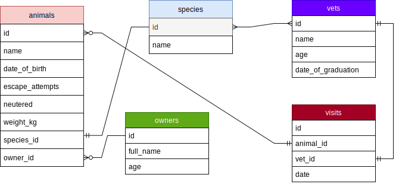

# vet-clinic-projects-template

> This project is used as an introduction practice for Postgresql.

## Getting Started

This repository includes files with plain SQL that can be used to recreate a database:

- Use [schema.sql](./schema.sql) to create all tables.
- Use [data.sql](./data.sql) to populate tables with sample data.
- Check [queries.sql](./queries.sql) for examples of queries that can be run on a newly created database. **Important note: this file might include queries that make changes in the database (e.g., remove records). Use them responsibly!**

## Schema Diagram

## Authors

👤 **Ja'fer Yousef**

- GitHub: [@githubhandle](https://github.com/jaferIdrees)
- Twitter: [@twitterhandle](https://twitter.com/jafel_l)
- LinkedIn: [LinkedIn](https://www.linkedin.com/in/jafer-idrees/)

👤 **Karam Fouad**
- GitHub: [@githubhandle](https://github.com/karam084)
- Twitter: [@twitterhandle](https://twitter.com/ElarabFouad)
- LinkedIn: [LinkedIn](https://www.linkedin.com/in/karam-fouad-179830214/)

## 🤝 Contributing

Contributions, issues, and feature requests are welcome!

Feel free to check the [issues page](https://github.com/jaferIdrees/vet_clinic_db/issues).

## Show your support

Give a ⭐️ if you like this project!

## Acknowledgments

- Hat tip to anyone whose code was used
- Inspiration
- etc

## 📝 License

This project is [MIT](./MIT.md) licensed.
